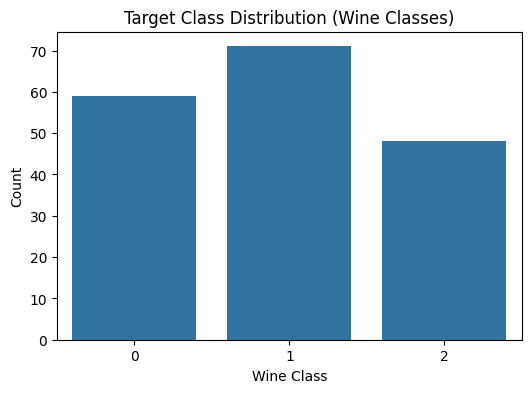
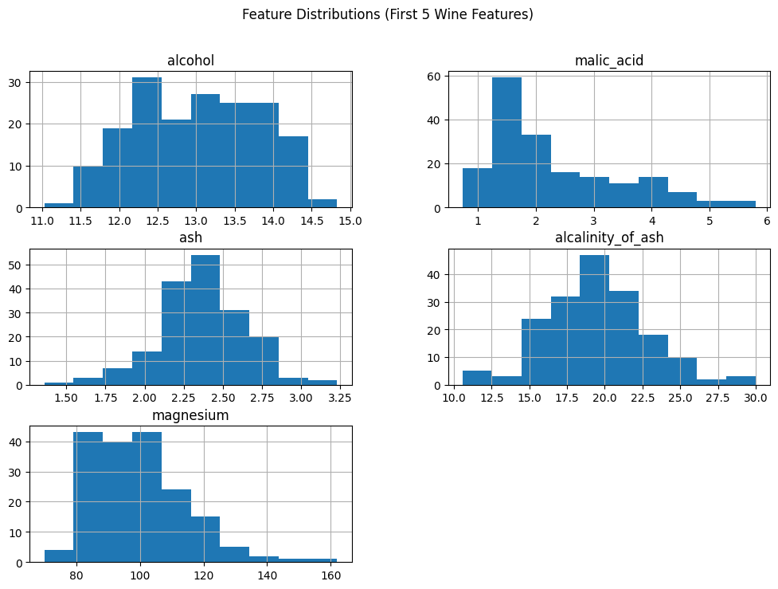
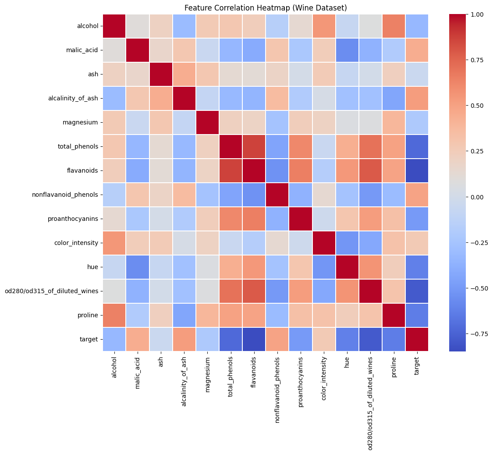
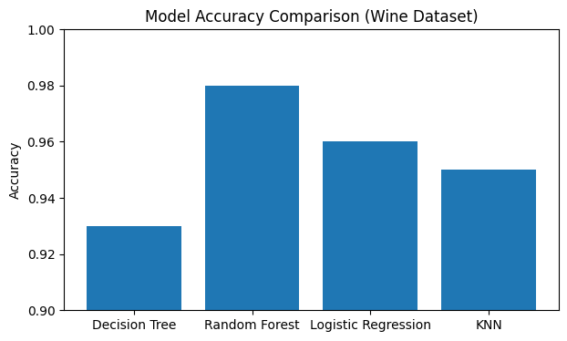

🔹 Target Class Distribution
### Target Class Distribution

This count plot shows the distribution of samples across the three wine classes.

🔹 Feature Distributions (First 5 Features)
### Feature Distributions (First 5 Wine Features)

These histograms visualize the distributions of the first five numerical features.

🔹 Feature Correlation Heatmap
### Feature Correlation Heatmap

This heatmap shows pairwise correlations between all numerical features.

🔹 Model Accuracy Comparison
### Model Accuracy Comparison

This bar chart compares the accuracy of different machine learning models.
